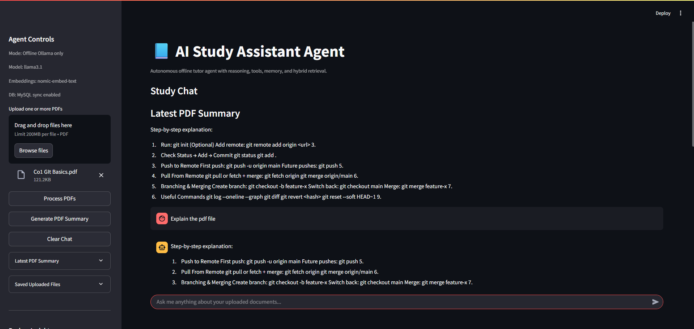
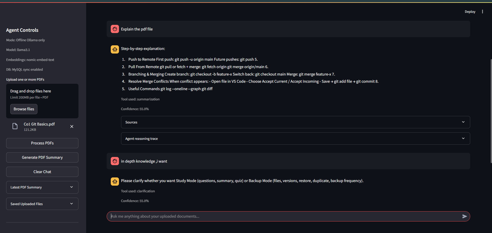

# AI Study Assistant (Offline) + Smart Backup Assistant

AI Study Assistant is a local-first Streamlit app that combines:

- Document study tools (Q&A, summarization, quiz generation, calculator, memory)
- Backup intelligence tools (versions, timeline, duplicate checks, restore guidance)

The project is designed to run fully offline with Ollama models, while also supporting optional MySQL persistence for backup metadata.

## App Screenshot

### Screenshot 1



### Screenshot 2




## What This App Does

- Upload and process PDF files for retrieval-augmented study.
- Answer questions grounded in uploaded documents.
- Generate and display a persistent "Latest PDF Summary" under Study Chat.
- Store uploaded original files locally for later download.
- Track inferred file and summary versions in local app state.
- Route backup-related chat requests to backup tools.
- Optionally sync backup/file metadata to MySQL.

## Core Rule: Latest File Priority

For document-based study requests, the assistant prioritizes the most recently uploaded file.

- Applies to: document Q&A, summarize, and quiz generation.
- If user explicitly asks for an older file/version, that override is allowed.
- If no recent uploaded document can be resolved, response is:
  - `No recent uploaded document found`

## Current Architecture

```text
AI-Study-Assistant/
|-- app.py
|-- README.md
|-- requirements.txt
|-- agent/
|   |-- __init__.py
|   |-- agent_controller.py
|   `-- tools.py
|-- memory/
|   |-- __init__.py
|   `-- memory_manager.py
|-- retrieval/
|   |-- __init__.py
|   |-- hybrid_retriever.py
|   `-- reranker.py
|-- scripts/
|   `-- health_check.py
`-- utils/
    |-- __init__.py
    |-- backfill_mysql.py
    |-- db_store.py
    |-- embeddings.py
    |-- llm_handler.py
    |-- pdf_loader.py
    `-- retriever.py
```

## Agent Behavior

The controller uses a structured loop:

1. Thought: classify intent (study vs backup vs ambiguous)
2. Action: choose and run tool
3. Observation: collect tool output
4. Reflection: verify grounding/quality
5. Final answer: return structured output

### Study Tools

- `document_qa`
- `summarization`
- `quiz_generator`
- `calculator`
- `memory_retrieval`

### Backup Tools

- `file_upload_tool`
- `file_list_tool`
- `version_history_tool`
- `restore_version_tool`
- `duplicate_detection_tool`
- `backup_frequency_tool`
- `file_diff_tool`
- `timeline_tool`

## Storage Model

### Local (always used)

- App state: `.agent_data/app_state.json`
- Uploaded originals: `.agent_data/uploads/`
- Retriever index: `.agent_data/retriever/`
- Memory state: `.agent_data/memory/`

### MySQL (optional but supported)

When MySQL is configured, backup metadata is persisted in:

- `files`
- `file_versions`
- `backup_logs`
- `file_usage`

The app supports DB-first reads for backup intelligence with local fallback.

## Response Contract

Study and backup responses are formatted as JSON-like output:

```json
{
  "final_answer": "...",
  "confidence": "low|medium|high",
  "sources": [
    {
      "document_or_file": "...",
      "version": "...",
      "timestamp": "...",
      "snippet": "..."
    }
  ]
}
```

Grounding rules:

- Missing study evidence: `Not found in document.`
- Missing backup/system evidence: `Not found in system.`

## Setup

### 1) Create and activate virtual environment

```powershell
python -m venv .venv
.\.venv\Scripts\Activate.ps1
```

### 2) Install dependencies

```powershell
pip install -r requirements.txt
```

### 3) Configure environment

Create `.env` in project root. Recommended Ollama-first config:

```env
LLM_PROVIDER=ollama
OLLAMA_BASE_URL=http://localhost:11434
OLLAMA_MODEL=llama3.1
OLLAMA_EMBEDDING_MODEL=nomic-embed-text

# Optional MySQL persistence
DB_PROVIDER=mysql
MYSQL_HOST=localhost
MYSQL_PORT=3306
MYSQL_DATABASE=ai_study_backup
MYSQL_USER=<your_mysql_user>
MYSQL_PASSWORD=<your_mysql_password>
```

Notes:

- `.env.example` exists as a template.
- Keep secrets only in local `.env` and never commit credentials.

### 4) Pull Ollama models

```powershell
ollama pull llama3.1
ollama pull nomic-embed-text
```

### 5) Run the app

```powershell
streamlit run app.py
```

## How To Use

1. Upload one or more PDFs from the sidebar.
2. Click Process PDFs.
3. Use Generate PDF Summary to refresh the latest summary.
4. Ask study questions in chat.
5. Use backup questions in chat (examples below).
6. Download saved originals from Saved Uploaded Files.
7. Review Backup Insights and Timeline in sidebar.

### Study Query Examples

- `summarize this document`
- `create a quiz from this file`
- `what are the key points from chapter 2?`
- `calculate 23*19`

### Backup Query Examples

- `show version history`
- `is this a duplicate file?`
- `what changed after restore?`
- `how often should I back up this file?`
- `show file timeline`

## Health Check

Run full readiness checks:

```powershell
python scripts/health_check.py
```

The script validates:

- environment variables
- Ollama API availability
- local state artifacts
- retriever + memory loading
- MySQL connection and schema
- agent routing

## Backfill Historical State to MySQL

If you have existing local `.agent_data/app_state.json` and want to sync historical metadata:

```powershell
python -m utils.backfill_mysql
```

The app also performs one-time startup auto-backfill when DB is empty and local state exists.

## Troubleshooting

- `No recent uploaded document found`
  - Upload and process at least one PDF.
  - Check `.agent_data/uploads/` exists and contains files.

- `Not found in document.`
  - Question may not be grounded in indexed chunks.
  - Reprocess PDFs or ask a more specific query.

- MySQL check fails in health check
  - Verify `DB_PROVIDER=mysql`.
  - Verify credentials and DB permissions.
  - Ensure MySQL server is running and reachable.

- Ollama API fails
  - Start Ollama and confirm `OLLAMA_BASE_URL`.
  - Confirm required models are pulled.

## Security Notes

- Do not hardcode secrets in code.
- Keep DB credentials in local `.env` only.
- Rotate credentials immediately if leaked.

## License

No license file is currently included in this repository.
